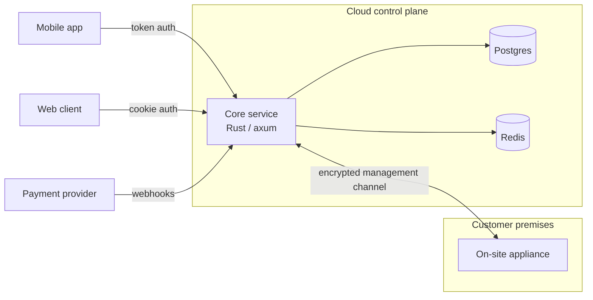

# Solo-building a SaaS with hardware in the field: Rust, 1,000+ tests, and a team of one

I run Dymora, a connected-building platform I built and operate alone: an appliance installed on the customer's premises, a cloud control plane, and a mobile app, sold as a subscription. It is live, in production, with paying customers.

This post is about what "production" means when there is exactly one engineer: every architectural decision is also an operational decision, because the person woken up by the pager is the person who wrote the bug. Here is what that constraint produced.

## The shape of the system

The core service is ~63k lines of Rust (axum, tokio, sqlx, Postgres, Redis), with an OpenAPI 3.0 spec covering 49 paths and 58 operations, maintained by hand alongside the code. It owns identity for two client types (browser sessions and native mobile, over one API), the full customer lifecycle, billing, push notification fan-out, and brokered access to on-site devices.

## One state machine to rule the business

The most important design decision in the codebase is boring on purpose: **every customer is a row in a lifecycle state machine**, and every transition is guarded at the database level.

A customer's state is driven by three uncoordinated actors: a technician doing an on-site install, payment webhooks arriving in whatever order the provider feels like, and the customer tapping buttons in an app. The only way to keep that sane solo is to make illegal transitions unrepresentable:

- All lifecycle writes go through a single guarded-transition function — an atomic `UPDATE` that carries its allowed predecessor states, where zero rows affected means the precondition failed and the caller must handle it. Naked status updates are banned by convention; the one documented exception carries its own guard.
- The same rules are enforced twice more: as constraints in Postgres, and as a dedicated test suite that attempts every illegal transition and expects rejection.

When a payment webhook and a technician action race, one of them loses cleanly instead of both half-winning.

## Testing: 1,000+ tests, and integration tests that need no database

The service has about 500 unit tests and about 540 integration tests. The integration suite spins up the real axum app on an ephemeral port — but against **in-memory implementations of every port**, so the full HTTP contract runs in seconds with no Postgres or Redis.

That's possible because the architecture is hexagonal in the unfashionable, literal sense: the app state is a bundle of ~20 `Arc<dyn Trait>` ports (persistence, payments, push delivery, device access, …), the domain layer imports no SDKs, and vendor types are confined to adapter modules and mapped at the boundary. The payment SDK appears in exactly one file.

Postgres itself is not trusted on faith either. A separate suite of **DB-invariant tests** asserts the things the type system can't see: constraint behavior, retention sweeps, and that the audit log is append-only *at the database level* — so even a buggy privileged endpoint can't rewrite history.

## Billing without double-charging anyone

Payment webhooks (Stripe, in my case) are at-least-once, unordered, and occasionally ancient. The handler defends in two layers:

1. **Fast path:** an atomic set-if-absent on the event ID in Redis (with TTL) drops most duplicates before any work happens.
2. **Source of truth:** the event ID is recorded in Postgres with an insert-if-new, *in the same transaction as the state change it causes*. If the record already exists, the transaction is a no-op. Redis can be flushed at any time without a correctness problem — it's only an optimization.

Signature verification runs on the raw request bytes before any parsing, and processed-event records are swept after a retention window.

The part I'd actually recommend to other solo builders: **I didn't integrate billing into the production service first.** I built a throwaway sandbox service and ran six planned sprints of checkout, webhook, and subscription-lifecycle experiments against the provider's test clock until the edge cases (proration, trial expiry, payment failure and recovery) were boring. Then I ported the now-proven design into production code. The PoC found the design mistakes where they cost nothing.

## Security decisions worth stealing

- **Broker, don't store in the clear.** Where the control plane must hold reversible third-party credentials, they are AES-256-GCM envelope-encrypted with a fresh nonce per use; the key lives in a zeroize-on-drop wrapper and never appears in SQL. There's a comment at the site explaining why this one secret is reversible while passwords are one-way hashed — because in five years I won't remember, and the next maintainer (possibly also me) shouldn't have to guess.

## Deploys you can trust at 1 a.m.

- Push to the dev branch → tests → image build → auto-deploy to a fully separated staging environment.
- Prod is different on purpose: an annotated semver tag builds an **immutable image**, and promotion to production is a human action against a pinned digest, behind a required-reviewer gate. CI can never surprise production.
- 41 migrations, every single one with a tested down-path. Migrations run at boot — but only *after* all config constructors, so a misconfigured deploy fails before it advances the schema past a rolled-back image. That ordering is a scar, not a theory: it comes from a real incident.
- Graceful shutdown drains in-flight async work with a bounded timeout, so a deploy doesn't eat notifications mid-send.

## The part where software meets drywall

The hard 20% of this business is that part of my infrastructure lives on customer premises, behind consumer routers I don't control.

- **Zero-touch provisioning:** a customized unattended-install image takes a blank device to a fully-enrolled fleet node — full-disk encryption with the key sealed in the device's TPM (so it boots unattended but a stolen disk is useless), secure-channel enrollment, monitoring heartbeat — without me typing into it.
- **Redundant remote management:** more than one independent path to every device, because when you can't drive to a customer's home to fix a bad route, "the change that locks you out" is an existential bug class. Remote network changes are wrapped in a commit/confirm window — if the change breaks connectivity and the session can't reconnect to confirm, the device reverts itself.
- **Canary rule as an invariant:** every change rolls to my own internal device first, then one production device, then a 24-hour soak, then the rest. Never two changes in one rollout window — when something breaks, I want exactly one suspect.

## Operating alone without lying to yourself

Monitoring built by the person it will wake up:

- A **dead-man switch** watches heartbeats from every server and device — and it deliberately runs in a different failure domain from the fleet, so a provider-wide outage can't take down the thing that reports outages. An external check watches the watcher.
- The monitoring runbook's rule 3: *"A quiet alert channel is not proof the channel works."* That rule exists because a messaging-platform migration once silently broke alerting fleet-wide, and everything looked green. Now the alert path itself is heartbeat-tested.
- Backups are nightly, encrypted, deduplicated, and **append-only** — a compromised machine can add snapshots but not destroy history — plus an independent manual database dump before every prod release, kept as a second restore path on purpose.
- Every incident becomes a runbook entry or an operating rule, with the story attached. Documentation of *why* is the only teammate I have.

## Honest costs

Things I got wrong or would do differently:

- I hand-rolled a ~14k-line server-rendered internal admin tool. It's well-tested and audited, but it's roughly a fifth of the codebase spent on non-differentiating surface — today I'd evaluate off-the-shelf harder before building.
- Deliberate deferral is a skill I had to learn: more than once I've fully built a feature, written the analysis proving it can be enabled later without a migration, and then consciously *not shipped it* because the customer-facing lifecycle mattered more. Scope discipline beats feature count when the team is one person.
- Some infra automation shipped after the fleet did — early devices were hand-configured, and the automation had to be written to converge on reality rather than define it. The write-up of that gap is in the repo, dated honestly.

## Numbers

| Metric | Value |
|---|---|
| Core service | ~63k LOC Rust (axum/tokio/sqlx) |
| Tests | 1,049 (~500 unit + ~540 integration, incl. DB-invariant suite) |
| HTTP API | 49 paths / 58 operations, OpenAPI 3.0 spec maintained by hand |
| Migrations | 41, all reversible, all with tested down-paths |
| Environments | Fully separated staging + production (separate DBs, secrets, billing config) |
| Ops docs | ~40k lines of runbooks, decision records, and incident-derived rules |
| Team | 1 |

---

*I'm Federico Gambassi — I designed, built, and operate everything above. If your team ships LLM systems or production Rust and this sounds like how you want infrastructure treated: [GitHub](https://github.com/comprido96) · [LinkedIn](https://www.linkedin.com/in/federico-gambassi/) · fedegambassi96@gmail.com*
